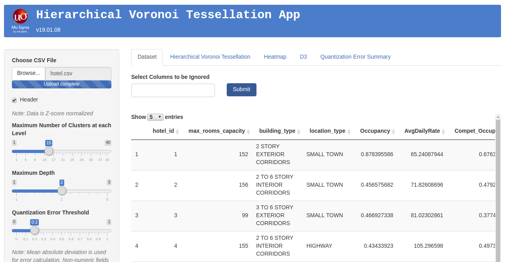
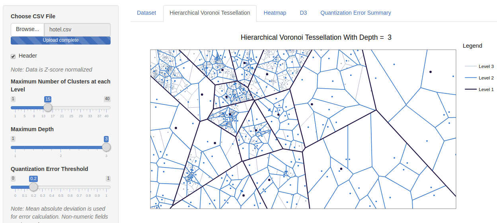
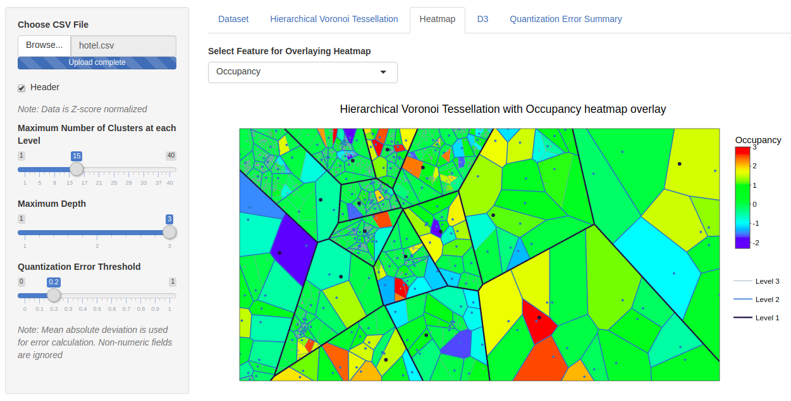
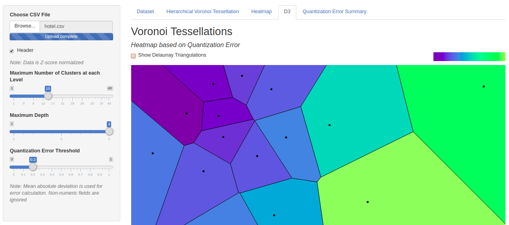
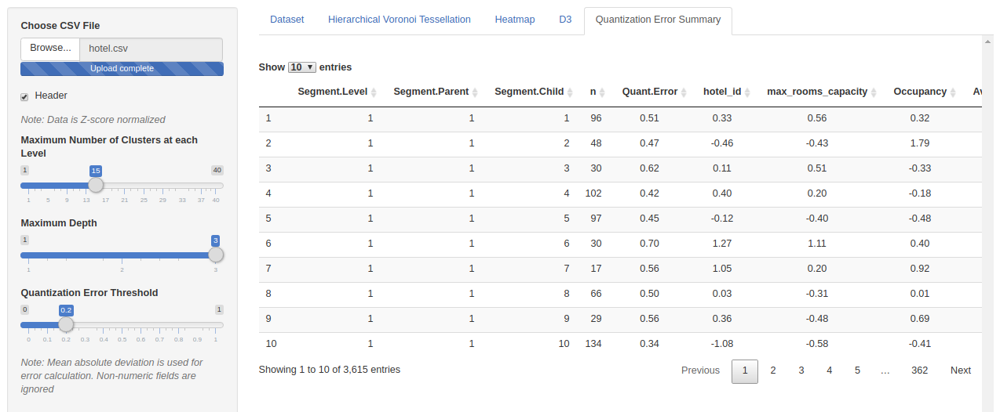

## Multivariate data visualization app

HVT App is a tool to visualize rich multivariate data by constructing hierarchical Voronoi Tessellations. It also provides functionality to overlay heat map of the selected features on the tiles of the tessellations.

The Shiny app contains the following features:
1. Visualization for Hirarchical Voronoi Tessellations using muHVT
2. Feature overlay heatmaps
3. Summary table for accessing data corresponding to each cell
4. Voronoi tessellations using D3

Description corresponding to each tab is as below:
### 1. Left Pane
Contains the option to load the dataset along with sliders for user input as enlisted below. These inputs are applicable to all the tabs

* **Maximum number of clusters at each level:** An integer indicating the maximum number of cells per hierarchy
* **Maximum Depth:** An integer indicating the maximum number of levels. (1 = No hierarchy, 2 = 2 levels, etc …)
* **Quantization Error Threshold:** A number indicating the quantization error threshold. A cell will only breakdown into further cells only if the quantization error of the cell is above quantization error threshold.

### 2. Dataset View
The view displays the dataset that has been imported in the app

* It contains the option to ignore the columns that are not to be used
* Sample dataset can be accessed from the Data folder 

### 3. Hierarchical Voronoi Tessellation View
This view displays the HVTs created using the imported data

* The number of clusters, depth and quantization error threshold can be selected using the slider in the left pane
* The feature to be overlayed can be selected from the dropdown above the plot
* Displays the level, parent and child for each cell on hover

### 4. Heatmap View
This view displays the heatmap which has been overlayed on top of the HVT plot for the selected feature (required feature can be selected using the dropdown)

* Displays the centroid data for a particular cell on hover 

### 5. D3 View
This view displays Voronoi Tessellations created using D3

* Presently renders plots only till the first level
* The cells highlight on hover and quantization error value for that cell is displayed
* This tab is currently work in progress

### 6. Quantization Error Summary
Provides a summary table for accessing centroid data corresponding to each cell

* The level, parent and child corresponding to each cell can be obtained on hover in HVT view 

